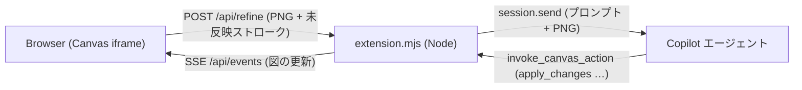

# shape

**[English](README.md) | [日本語](README.ja.md)**

フリーハンドで描いた「箱と矢印」のラフを、Copilot エージェントが**編集可能なベクター図**に仕上げる GitHub Copilot App の Canvas 拡張です。

清書後も手描きで追記 → 「✨ Finish」で追記分だけ AI が反映、を繰り返して図を育てられます。

なお、キャンバス UI の表示言語は英語です。AI への指示や図中のラベルは日本語のまま扱われ、手書き文字も元の言語で転記されます。

## デモ

https://github.com/user-attachments/assets/fa7a0b5b-ad2b-45bd-a2c8-1afa117d753e

動画ファイルは [`docs/videos/shape-demo.mp4`](docs/videos/shape-demo.mp4) にも置いてあります。

## 特長

- 依存パッケージなし・ビルド不要（Vanilla JS + SVG、Node 標準ライブラリのみ）
- 手描き（未反映）ストロークは色付きで表示され、AI には追記分だけが伝わる
- 図形・矢印はそのまま編集可能（選択・移動・リサイズ・ラベル編集・スタイル変更）
- 矢印は要素にバインドされ、箱を動かすと追従
- Undo / Redo、パン・ズーム、SVG / PNG / JSON / Mermaid エクスポート
- 外部ネットワークや外部 LLM API は使わず、ユーザーの Copilot セッションのモデルを利用
- Azure と明確に分かるスケッチや指示では、公式 Azure アイコン、サービス名、ネットワーク境界、方向付きの接続を使って仕上げる

## インストール

### 方法 A: このリポジトリから導入する（推奨）

```powershell
git clone https://github.com/yuriwoof/shape.git "$env:USERPROFILE\.copilot\extensions\shape"
```

Copilot App で拡張を再読み込みすると、Canvas 一覧に **shape** が表示されます。

> 開発時はリポジトリを別の場所に置き、`~/.copilot/extensions/shape/extension.mjs` に
> `import "file:///<リポジトリへの絶対パス>/extension.mjs";` だけを書いたシムを置く方法が便利です
> （ジャンクション／シンボリックリンクは拡張として検出されません）。

### 方法 B: `install_extension` ツールで導入する

Copilot セッション内であれば、このリポジトリの GitHub 上のフォルダー（または `share_extension` で作成した gist）から、エージェントに直接インストールしてもらうこともできます。`git clone` を手動で行う必要はありません。エージェントが `install_extension` ツールにこのリポジトリの URL を渡すと、ファイルが書き込まれた後に Copilot App が自動で拡張を再読み込みします。

## 使い方

1. Canvas 一覧から **shape** を開きます（またはチャットで「shape で図を描きたい」などと依頼します）。

   

2. ペンツールを選び、箱・矢印・文字をラフに手描きします。

   

3. 必要なら下部の入力欄に指示（例:「3 層構成にして DB を追加」「左→右レイアウト」）を書き、**✨ Finish**（Ctrl+Enter）を押します。
4. スケッチ画像と現在の図がチャットに送られ、エージェントがラフな手描きをきれいな編集可能な図形に置き換えます。
5. 仕上がった図の上にさらに手描きで追記し、再び仕上げることができます。選択・ドラッグ・リサイズ・ダブルクリックでのラベル編集など、手動で直接編集することもできます。

   

仕上げ時は、手描きの輪郭だけでなく、認識できる記号の意味、近くのラベル、接続関係、入力した指示を合わせて解釈します。現在の汎用図形の範囲では、ユーザーや人型の記号はラベル付きの楕円、VM やサーバーはラベル付きの角丸四角形、データベースは円柱へ変換します。意味が曖昧なラベルなしの箱には技術名を推測で付けず、汎用図形のまま仕上げます。Azure Virtual Machine は収録済みの公式アイコン一覧に含まれないため、現時点ではラベル付きの角丸四角形で表します。

### Azure アーキテクチャ図

「Azure App Service から Azure SQL Database に接続する構成を描いて」など、Azure サービスや Azure 構成が明確な指示・スケッチでは、対応サービスを公式アイコン付きの編集可能な要素に変換します。「Web → DB」のように曖昧な図は従来の汎用図形で仕上げます。VNet やサブネットなどはラベル付きのグループ枠で表し、PaaS サービスをプライベート エンドポイント経由で接続する場合、そのサービス自体をサブネット内には置きません。

対応アイコン: Azure App Service、Azure Application Gateway、Azure Web Application Firewall policy、Azure Virtual Network、Azure Private Endpoint、Azure SQL Database、Azure Key Vault、Azure Storage account、Azure Front Door、Azure Monitor。未対応・特定できないサービスは、別のサービスのアイコンへ推測で置き換えず、名前を表示した汎用図形にします。要素を選択してプロパティの「形」を「Azure サービス」に変更するか、サービスのドロップダウンから別のサービスを選ぶこともできます。アイコンそのものの縦横比・色は編集できません。

SVG / PNG は公式アイコンを含めて保存され、JSON はサービス ID を含む編集可能な要素情報を保存します。Mermaid はアイコンを表現できないため、正式名称付きの汎用ノードで出力します。既存の図には変更を加えません。

### ショートカット

| キー | 動作 |
|---|---|
| V / H / P / E | 選択 / パン / ペン / 消しゴム |
| R / O / D / A / T | 四角 / 楕円 / ひし形 / 矢印 / テキスト |
| Space + ドラッグ、中ボタン | パン |
| Ctrl + ホイール | ズーム |
| Shift + 1 | 全体を表示 |
| Ctrl+Z / Ctrl+Shift+Z | 元に戻す / やり直す |
| Delete | 選択要素を削除 |
| ダブルクリック | ラベル編集 |

## アーキテクチャ



| パス | 役割 |
|---|---|
| `extension.mjs` | `createCanvas` による Canvas 登録、エージェント向け action、仕上げ依頼の送信 |
| `lib/server.mjs` | 127.0.0.1 限定の HTTP サーバー（静的配信、`/api/*`、SSE）。トークン認証・Host 検証・CSP 付き |
| `lib/store.mjs` | ドキュメントの永続化（`~/.copilot/shape-data/<documentId>.json`） |
| `lib/prompt.mjs` | エージェント向け仕上げプロンプトの生成 |
| `core/` | ブラウザとNode で共有するモデル（検証・差分適用・矢印バインド）、幾何計算、SVG 描画、Mermaid 変換 |
| `public/` | フロントエンド（`index.html`, `app.js`, `style.css`） |

### Canvas actions（エージェント向け）

| action | 内容 |
|---|---|
| `get_diagram` | 要素と未反映ストローク（bbox・簡略化した点列付き）を返す |
| `apply_changes` | add / update / delete の差分適用と、反映済みストロークの消去（`consumeStrokes`） |
| `replace_diagram` | 図の全置換 |
| `clear_sketch` | 未反映ストロークの削除 |
| `export` | SVG / JSON / Mermaid を返す（任意でダウンロードフォルダーへ保存） |

要素の種類は `rect | rounded | ellipse | diamond | cylinder | text | frame | azure-service | arrow` です。`azure-service` には対応する `service` ID を指定します。矢印は `from` / `to` で要素 id にバインドします。

公式アイコンは [Azure Architecture Center の配布物](https://learn.microsoft.com/azure/architecture/icons/) から選定し、`core/azure-icons.mjs` に収録しています。このファイル中のアイコンは **Microsoft の利用条件**（アーキテクチャ図、研修資料、ドキュメントでの利用に限定）に従い、リポジトリの MIT ライセンスの対象ではありません。アイコンを切り抜く・反転する・回転する・変形する用途や、自社製品のアイコンとしての利用は避けてください。元の公式 ZIP からカタログを更新するときは `python scripts/update-azure-icons.py <Azure_Public_Service_Icons_V24.zip>` を実行します。実行時のネットワーク接続は不要です。

## 開発

```powershell
npm test   # node --test "test/*.test.mjs"
```

Node 20 以降を想定しています。

## ライセンス

[MIT](LICENSE)
