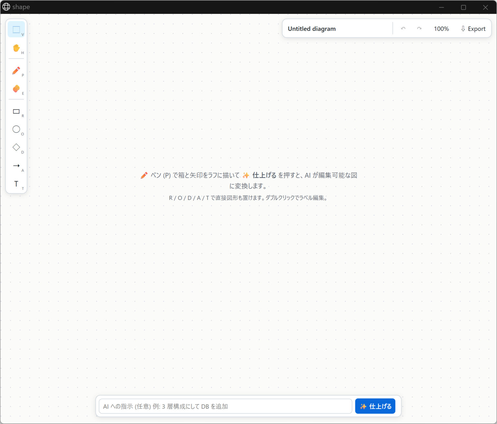
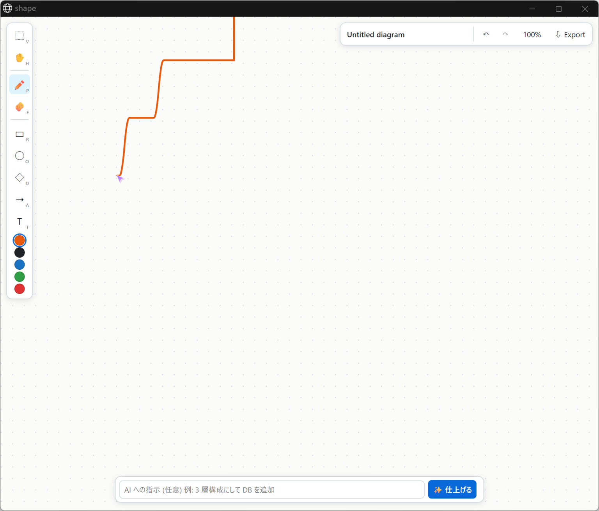
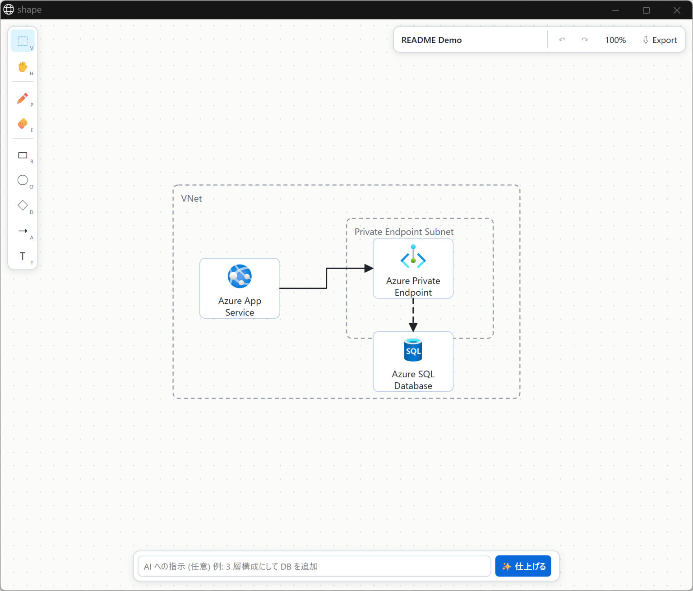
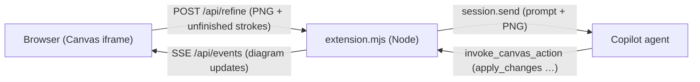

# shape

**[English](README.md) | [日本語](README.ja.md)**

A Canvas extension for the GitHub Copilot App that turns a freehand "boxes and arrows" sketch into a **fully editable vector diagram**, drawn by a Copilot agent.

Keep sketching on top of the finished diagram and press "✨ Finish" again — only the new strokes are sent to the AI, so the diagram grows incrementally.

## Features

- No dependencies, no build step (vanilla JS + SVG, Node standard library only)
- Unfinished freehand strokes are shown in color; only the new strokes are sent to the AI on each refine
- Shapes and arrows stay fully editable (select, move, resize, edit labels, restyle)
- Arrows are bound to the elements they connect, and follow when a box is moved
- Undo / redo, pan & zoom, export to SVG / PNG / JSON / Mermaid
- No external network calls or external LLM APIs — it uses the model already powering your Copilot session
- When a sketch or instruction clearly refers to Azure, the agent finishes it with official Azure icons, correct service names, network boundaries, and directional connections

## Installation

### Option A: Install from this repository (recommended)

```powershell
git clone https://github.com/yuriwoof/shape.git "$env:USERPROFILE\.copilot\extensions\shape"
```

Reload extensions in the Copilot App and **shape** will appear in the Canvas list.

> For active development, keep the repository checked out elsewhere and put a one-line shim at
> `~/.copilot/extensions/shape/extension.mjs`:
> `import "file:///<absolute path to repo>/extension.mjs";`
> (junctions/symlinks are not detected as extensions by the Copilot App).

### Option B: Install with the `install_extension` tool

If you're working inside a Copilot session, you can ask the agent to install the extension directly from this GitHub repository folder (or from a gist produced by `share_extension`) — no manual `git clone` required. The agent calls the `install_extension` tool with this repo's URL, and the Copilot App automatically reloads extensions once the files are written.

## Usage

1. Open **shape** from the Canvas list (or ask in chat, e.g. "let's sketch a diagram with shape").

   

2. Pick the pen tool and rough out boxes, arrows, and labels freehand.

   

3. Optionally type an instruction in the bottom bar (e.g. "make it a 3-tier layout and add a DB", "left-to-right layout"), then press **✨ Finish** (Ctrl+Enter).
4. The sketch image and the current diagram are sent to the agent, which replaces your rough strokes with clean, editable shapes.
5. Keep sketching on top of the finished diagram and refine again whenever you like. You can also edit the shapes directly by hand (select, drag, resize, double-click to edit a label).

   

### Azure architecture diagrams

When a sketch or instruction clearly calls for Azure resources (e.g. "draw Azure App Service connecting to Azure SQL Database"), the agent converts the matching services into editable elements with official Azure icons. Ambiguous diagrams (e.g. "Web → DB") are still finished as plain generic shapes. VNets and subnets are represented as labeled group frames; when a PaaS service is connected through a private endpoint, the service itself is placed outside the subnet frame.

Supported icons: Azure App Service, Azure Application Gateway, Azure Web Application Firewall policy, Azure Virtual Network, Azure Private Endpoint, Azure SQL Database, Azure Key Vault, Azure Storage account, Azure Front Door, Azure Monitor. Unsupported or unidentifiable services are never guessed as a different service's icon — they're drawn as labeled generic shapes instead. You can also select an element and change its "Shape" property to "Azure service", or pick a different service from the dropdown. The icon's aspect ratio and colors can't be edited directly.

SVG / PNG exports include the official icons; JSON exports include the editable element data, including the service ID. Mermaid can't represent icons, so it exports generic nodes labeled with the official service name. Existing diagrams are never modified by this feature.

### Shortcuts

| Key | Action |
|---|---|
| V / H / P / E | Select / Pan / Pen / Eraser |
| R / O / D / A / T | Rectangle / Ellipse / Diamond / Arrow / Text |
| Space + drag, middle button | Pan |
| Ctrl + wheel | Zoom |
| Shift + 1 | Zoom to fit |
| Ctrl+Z / Ctrl+Shift+Z | Undo / Redo |
| Delete | Delete selected element(s) |
| Double-click | Edit label |

## Architecture



| Path | Role |
|---|---|
| `extension.mjs` | Registers the Canvas via `createCanvas`, defines agent-facing actions, sends refine requests |
| `lib/server.mjs` | Loopback-only HTTP server (static files, `/api/*`, SSE); token auth, Host validation, CSP |
| `lib/store.mjs` | Document persistence (`~/.copilot/shape-data/<documentId>.json`) |
| `lib/prompt.mjs` | Builds the agent-facing refine prompt |
| `core/` | Model shared between browser and Node (validation, diffing, arrow binding), geometry, SVG rendering, Mermaid conversion |
| `public/` | Frontend (`index.html`, `app.js`, `style.css`) |

### Canvas actions (for agents)

| Action | Description |
|---|---|
| `get_diagram` | Returns elements and unfinished strokes (with bbox and a simplified point list) |
| `apply_changes` | Applies an add/update/delete diff, and clears consumed strokes (`consumeStrokes`) |
| `replace_diagram` | Replaces the whole diagram |
| `clear_sketch` | Clears unfinished strokes |
| `export` | Returns SVG / JSON / Mermaid (optionally saved to the Downloads folder) |

Element types are `rect | rounded | ellipse | diamond | cylinder | text | frame | azure-service | arrow`. An `azure-service` element takes a matching `service` ID. Arrows bind to element ids via `from` / `to`.

Official icons were sourced from the [Azure Architecture Center icon set](https://learn.microsoft.com/azure/architecture/icons/) and are bundled in `core/azure-icons.mjs`. The icons in that file are governed by **Microsoft's terms of use** (restricted to architecture diagrams, training materials, and documentation) and are **not** covered by this repository's MIT license. Don't crop, flip, rotate, or otherwise alter the icons, and don't use them as your own product's icon. To refresh the catalog from an official ZIP, run `python scripts/update-azure-icons.py <Azure_Public_Service_Icons_V24.zip>` (no network access required).

## Development

```powershell
npm test   # node --test "test/*.test.mjs"
```

Requires Node 20 or later.

## License

[MIT](LICENSE)
